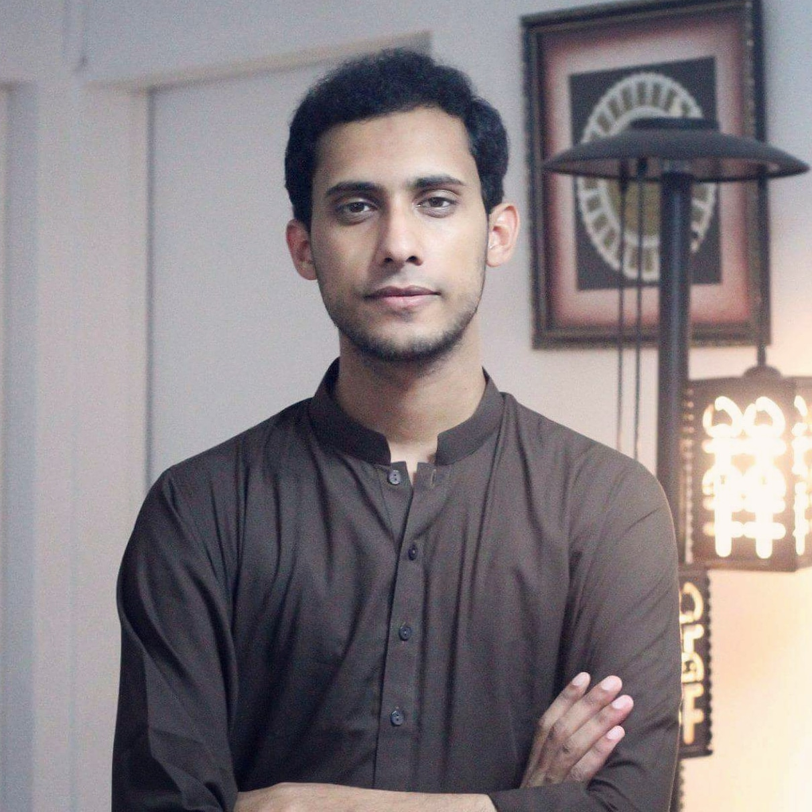

<!-- (comment) the image below can be found in img folder of this very project-->
{: style="float: right; margin: 0px 20px; width: 240px; height: 240px" name="fox"}

<!--  -->

I am Aizaz Sharif, a __Ph.D. student__ at Simula Research Laboratory and the University of Oslo. I'm very happy to be supervised by [Dusica Marijan]({{site:ivan_page}}) and [Arnaud Gotlieb]({{site.rico_page}}).

Previously, I was a __research associate__ at [NCCS]({{site.yandex_research_main}}) and worked closely with the Mobile Forensics by leading a software development team. 

You can find my resume [here](AizazSharifResume2020.pdf).

News 

* 02/2020 Its Corona time !!. 
* 02/2020 I started my [Ph.D.](https://www.simula.no/people/aizaz) at the __Simula Research Laboratory__, Norway. 
* 01/2020 __2__ papers published to IEEE Explore, one related to [Malware Analysis](https://ieeexplore.ieee.org/abstract/document/8958412/) and other in the field of [Medical Imaging](https://ieeexplore.ieee.org/abstract/document/8994408).
* 11/2019 Awarded as __Best Outstanding Paper__ in the CANDAR'19 conference, Nagasaki, Japan.
* 11/2019 Visiting Nagasaki, Japan to appear at [CANDAR'19](https://is-candar.org/) for presenting my Master's thesis: [Function Identification in Android Binaries with Deep Learning](https://ieeexplore.ieee.org/abstract/document/8958412/).
* 10/2019 Graduated as M.Sc. Computer Science in the [FAST NUCES](https://www.nu.edu.pk/) under the supervision of [Muhammad Nauman](https://recluze.net/).
* 09/2019 __1__ conference paper accepted to __CANDAR 2019__, Japan.
* 07/2019 __1__ journal paper published to __Transactions on Emerging Telecommunications Technologies__.
